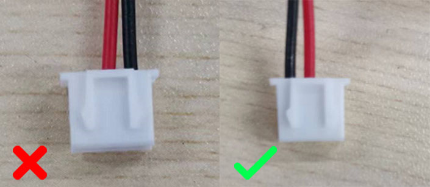

# FYSETC-ERCF-Kit

FYSETC ERCF (EnragedRabbitProject from EtteGit) Kit information

## Advantages

1. Fully automatic filament switching for multi-color printing, with a large number of compatible filament units.
2. Modular assembly method allows flexible adjustment of the number of replaceable filament units of the device according to your needs.
3. The ERB module is based on the RP2040 MCU and uses a power management chip. Compared with the LDO board, it generates less heat, has a higher output power, is more stable and uses the USB-C interface, so the device performance is improved.
4. the structure of the movement module part of the choice of chrome-plated optical shaft with engineering plastic bearings so that the device can run smoothly and quietly, different from the metal bearings is the engineering plastic bearings and optical shaft with small clearance device running higher precision.

## BOM

Check the file [N6](https://github.com/FYSETC/FYSETC-ERCF-Kit/blob/main/BOM-N6.xlsx) and [N9](https://github.com/FYSETC/FYSETC-ERCF-Kit/blob/main/BOM-N9.xlsx).

## Known issue

Please check your sensor cable before you power on the kit. The first batch of sensor and endstop cables were shipped with wrong pinout. For the sensor cable, swap the black and green wire on XH2.54 connector with a tweezer, for endstop cable move the black wire to the left, orthewise the sensor will be disabled.

### Correct wring

## Buy link

[Official Website](https://www.fysetc.com/products/fysetc-enrager-rabbit-carrot-feederercf-erb-board-multi-material-mmu-kit-for-voron-switchwire-voron-trident-voron-2-4?_pos=1&_sid=a548ba1b3&_ss=r)

[Amazon](https://www.amazon.com/FYSETC-Printer-Material-Filament-TMC2209-9/dp/B0BS3RLFN4?th=1)

[Aliexpress](https://pt.aliexpress.com/item/1005004557941268.html)
